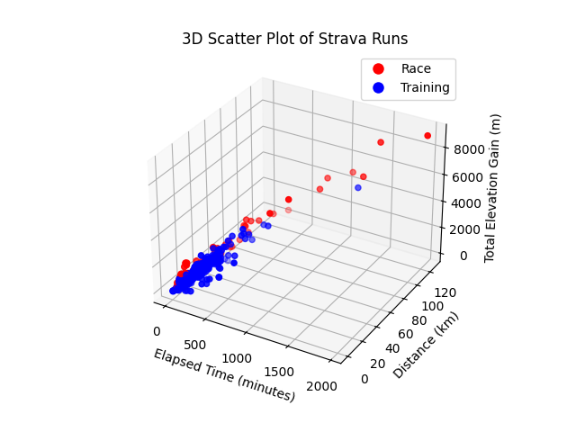
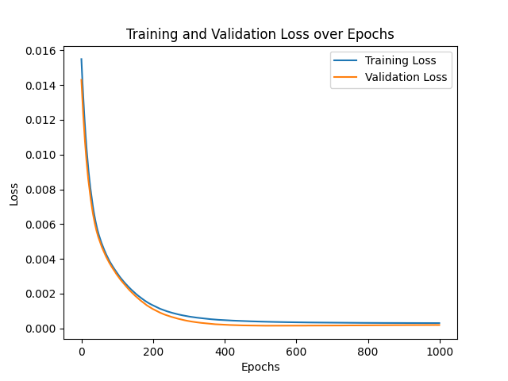

# StravaNeuralNetwork
Train a neural network with your Strava activities to predict runs durations

#### Motivations

* experiment with Neural Networks
* explore pandas, numpy, keras and tensorflow  
* predict runs durations
* experiment coding with ChatGPT

### 1. Download Strava Activities

Use your actual `client_id` and `client_secret`.

    python3 1_download_data.py

Aggregate various files / pages if needed.

### 2. Cleanup and Prepare Data

	python3 2_cleanup_data.py

         distance_km  elapsed_time_minutes  total_elevation_gain_meters  is_race
    0        15.0321            175.550000                       1431.0        0
    1        10.0309             71.800000                        630.0        0
    2        10.0634             47.416667                        104.0        0
    3        11.0464             51.800000                        119.0        0
    4       108.0240           1244.733333                       5969.0        1
    ..           ...                   ...                          ...      ...
    869      10.1212             51.766667                         61.6        0
    870      10.1472             56.500000                         79.0        0
    871       6.0131             30.283333                         97.1        0
    872       5.9310             29.516667                         97.8        0
    873       6.0525             32.583333                         99.0        0
    
    [874 rows x 4 columns]

### 3. Plot the Data

    python3 3_plot_data.py
	

### 4. Normalize Data and Train the Model

    python3 4_train_model.py

### 5. Use the Model to Predict Run Duration

	python3 5_use_model.py

	Predicted time for 10 km,  600 D+, race 0: 01:21
	Predicted time for 31 km, 2300 D+, race 1: 04:23
	Predicted time for  5 km,  850 D+, race 0: 01:09
	Predicted time for 10 km,   90 D+, race 0: 00:45
